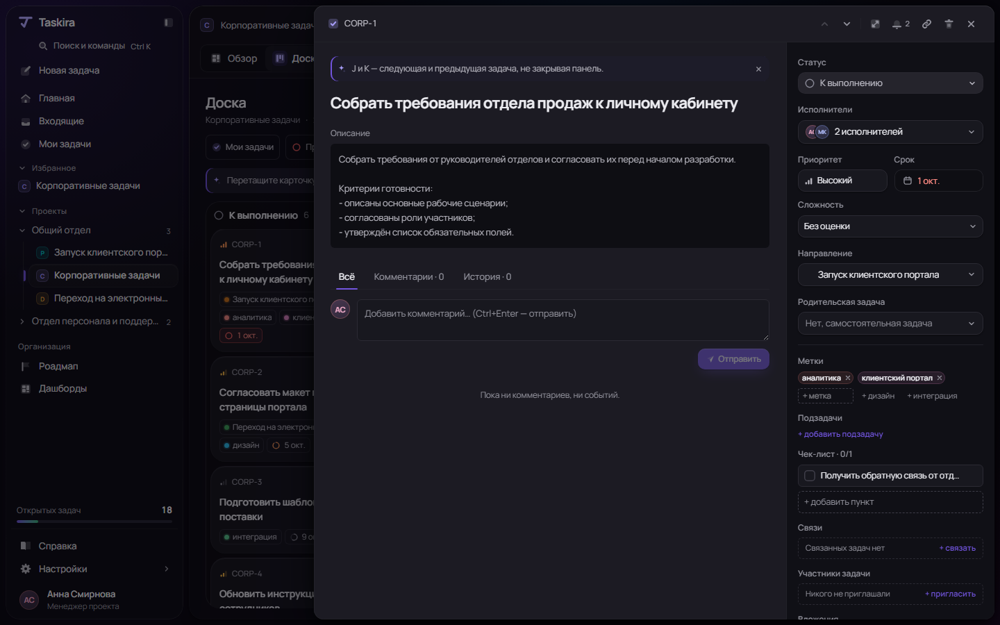
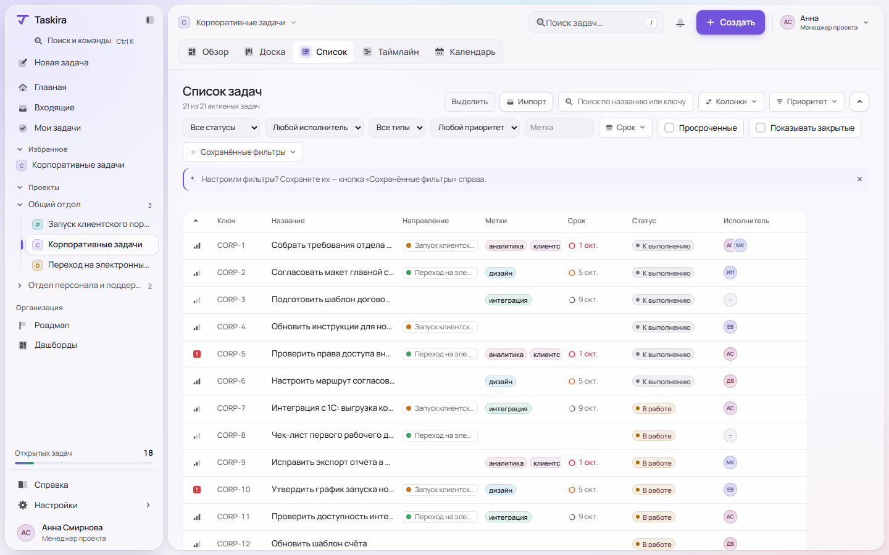
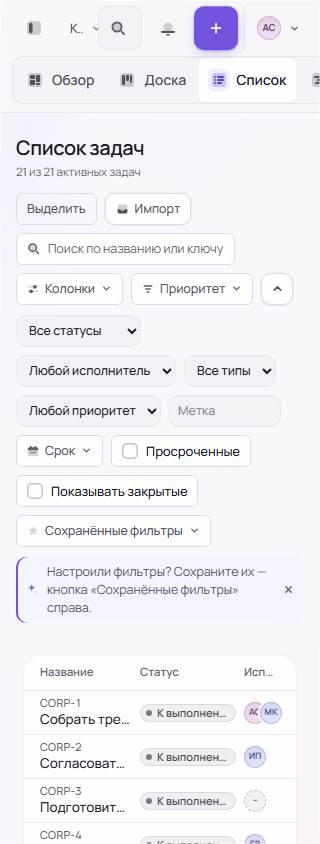
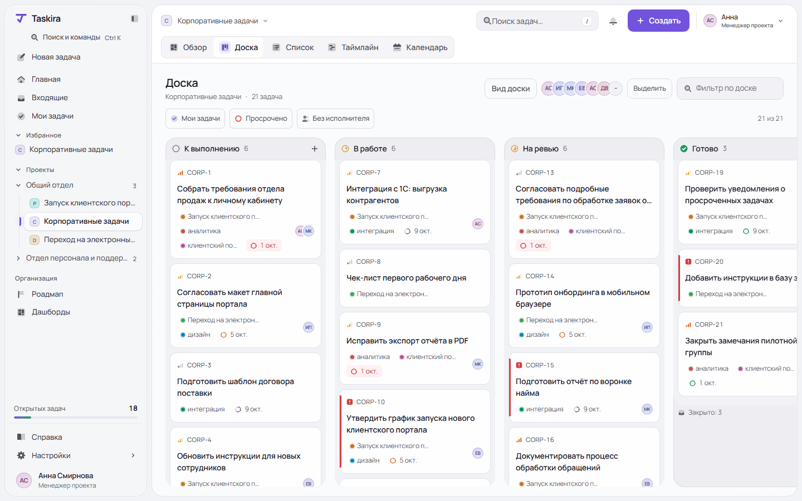
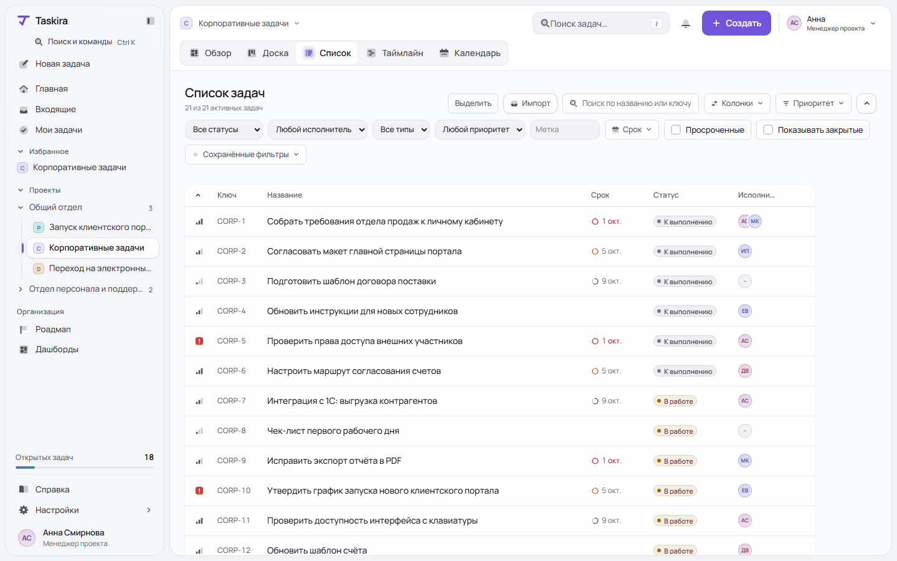
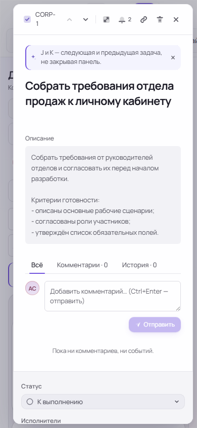

# Taskira: аудит UX, компонентов и общего визуального дизайна

**Дата:** 3 октября 2026 года, Asia/Tashkent. **Версия:** `a4df7b4b7f93f7b991b48207b24a286ea6e231f0`, main после PR #122.

## Основной вывод

У Taskira есть хорошая инженерная основа дизайна: токены, один основной шрифт, темы, библиотека компонентов, клавиатурные сценарии и проверки. Заменять её целиком на UI-кит по результатам этого аудита оснований нет.

Однако **целостный интерфейс пока уступает качеству своей основы**. На экранах слишком много рамок, округлённых поверхностей, маленьких плашек и служебной информации. Названия задач получают недостаточно места. Плотность и поведение различаются между представлениями. Отдельные реальные сценарии ломаются, хотя витрина компонентов и проверки токенов проходят.

Ощущение «всё как-то не то» объяснимо сочетанием трёх факторов:

1. **Визуальная иерархия:** оформление и метаданные конкурируют с содержанием задач.
2. **Композиция:** интерфейс экономит место на названиях, но расходует его на инструменты, контейнеры и повторяющиеся обозначения.
3. **Незавершённость интеграции:** общий компонент не гарантирует одинаковую плотность, корректную семантику и надёжное поведение на конкретном экране.

Это экспертная оценка интерфейса, а не измеренный результат пользовательского исследования. Конкретные воспроизведённые дефекты отмечены отдельно от дизайнерских гипотез.

## Что проверено и насколько надёжны выводы

- Изучены `src/ds`, дизайн-токены, стили, доска, список, карточка задачи, создание задачи, главная и навигация. Дополнительно просмотрены календарь, таймлайн, настройки, входящие, пустые состояния отчётов и роадмап.
- Снято **36 скриншотов**, включая два визуальных эксперимента. Все они находятся в `screens/` рядом с отчётом.
- Проверены светлая и тёмная темы; обычная и компактная плотность; ширины 1440, 1280, 1065, 768, 720, 390 и 320 CSS-пикселей в соответствующих сценариях.
- Использованы **синтетические данные**: пять проектов, два отдела, шесть сотрудников, 21 задача, четыре статуса, длинные названия, сроки, метки и направления. Данные и ответы API задаёт `capture.ts`. Реальные задачи и БД не изменялись.
- Проведены автоматические проверки axe на 32 состояниях страниц. Исключены недоступные элементы с `aria-disabled=true`, как в существующих тестах проекта. Два концепта и витринный пример не включены в эту численность.
- Успешно выполнены 26 тестов библиотеки компонентов и 9 браузерных тестов: витрина/клавиатура, позиционирование меню, сценарии PR #122 и ограничение действий наблюдателя.
- `contrast:check`, `colors:check`, `motion:check`, `antilist:check` проходят. При этом axe на реальных формах нашёл ошибки контраста: проверка правильных пар токенов не обнаруживает неправильное использование токена на экране.
- Браузер: Chromium, Windows. **Safari, Firefox, NVDA/VoiceOver и полный production CSP в этом аудите не проверялись.** 720 CSS-пикселей — проверка узкой компоновки, а не полноценная сертификация увеличения масштаба до 200%.
- На отчётах исследовано пустое состояние; корректность расчётов и агрегатов не проверялась. API и WebSocket в сценариях аудита изолированы от рабочего сервера.

Наблюдения и геометрия сохранены в `observations.json`. Старые иллюстрации из README не использовались как доказательство состояния после PR #122.

## Что уже сделано хорошо

1. **Система есть.** Цвета и поверхности имеют семантические роли, темы переопределяют общий слой. Это заметно лучше разрозненных CSS-решений.
2. **Manrope подходит продукту.** Шрифт читаемый, поддерживает кириллицу; проблема не требует смены семейства.
3. **PR #122 улучшил мобильную доску:** колонки расположены вертикально, поиск и основные действия адаптированы, кнопка переноса доступна без наведения. Проверенные страницы 320/390 не расширяют документ за экран.
4. **Главная стала полезнее:** показывает личные задачи по срочности и доступные проекты; при отсутствии назначенных задач проекты остаются доступными. Не следует возвращать большое пустое состояние, которое отодвигает проекты.
5. **Нативные диалоги и верхний слой — разумная основа.** Проверенные сценарии меню, Esc и возврата фокуса работают. Изолированная витрина не содержит serious/critical ошибок axe.
6. **Статусы не обозначены одним только цветом:** используются подписи и глифы. Критичный приоритет отличается формой и полосой. Эти признаки стоит сохранить.

## Приоритеты

P1 — сначала исправить: потеря ввода, неверный выбор, недоступное действие или воспроизводимый дефект доступности. P2 — существенное улучшение рабочего интерфейса. P3 — доведение семантики и менее срочная полировка. Приоритеты — оценка риска и частоты сценария, а не баллы автоматического инструмента.

| ID | Приоритет | Проблема | Статус доказательства |
|---|---|---|---|
| A01 | P1 | В узком списке нет действия открытия задачи с клавиатуры | Воспроизведено + подтверждено кодом |
| A02 | P1 | Ввод новой задачи теряется после Esc | Воспроизведено в обеих темах |
| A03 | P1 | Combobox выбирает старый вариант во время нового поиска | Воспроизведено на `/dev/ui` |
| A04 | P1 | Текстовые действия и выбранный тип задачи не проходят контраст в dark | Измерено axe на формах |
| A05 | P1 | Таблица обрезает правые действия на промежуточных ширинах | Измерена геометрия 1065/768/720 |
| A06 | P2 | Названия задач слишком узкие при стандартных колонках | Измерено + визуальная оценка |
| A07 | P2 | Мобильные инструменты отодвигают задачи вниз | Измерено + визуальная оценка |
| A08 | P2 | Фильтр теряется при переходе Доска → Список | Воспроизведено; изменение поведения требует продуктового решения |
| A09 | P2 | Компактная плотность не меняет высоту строк списка | Измерено: 44 px в обоих режимах |
| A10 | P2 | Метаданные слишком мелкие и перегружены плашками | Визуальная оценка + измерения |
| A11 | P2 | Общий визуальный дизайн слишком зависит от оформления контейнеров | Дизайнерская гипотеза; есть пример направления |
| A12 | P2 | В мобильной карточке свойства задачи находятся после комментариев и пустой ленты | Воспроизведён порядок; рекомендация по сценарию |
| A13 | P2 | Форма создания раскрывает слишком много необязательных свойств сразу | Дизайнерская гипотеза |
| A14 | P3 | Семантика вкладок неполная; axe отмечает пустой заголовок столбца действий | Проверка кода + axe; нужна проверка скринридером |

## A01. Открытие задачи с клавиатуры в узком списке

**Где:** `/p/CORP/list`, 320 и 390 px. Также важно для узкого окна на компьютере и людей с альтернативными средствами ввода.

**Наблюдение:** строка — `div role="row"` с `onClick`, без `tabIndex` и клавиатурного обработчика. Название — обычный `span`. На телефоне столбец действий скрыт. В порядке Tab остаются аватары, открывающие карточку человека. Проверка 42 последовательных Tab не обнаружила действия открытия задачи в строках.

**Последствие:** мышью или касанием задача открывается; с клавиатуры в строке такого действия нет. Поиск задачи через другое место приложения не делает сам список удобным или полноценно доступным.

**Исправление:** сделать название настоящей ссылкой на адрес задачи. Если нужен режим панели, обработать обычную активацию ссылки, сохранив возможность открыть адрес в новой вкладке. Меню действий должно быть доступно на всех ширинах. Не превращать строку в кнопку, внутри которой находятся другие кнопки.

**Критерий:** Tab достигает названия; Enter открывает задачу; Esc возвращает фокус; доступны меню и аватары; 320/390 px и обычная ширина проходят один сценарий. Основание: [WCAG 2.1.1 Keyboard](https://www.w3.org/WAI/WCAG22/Understanding/keyboard.html).

**Код:** `src/components/Backlog.tsx:123`, `src/components/Backlog.tsx:146`, `src/index.css:538`.

## A02. Потеря черновика создания задачи

**Шаги:** открыть создание → ввести «Черновик для проверки закрытия формы» → Esc → снова открыть создание.

**Результат:** название пустое. Повторено в light и dark. `onClose={close}` закрывает форму; сохранения черновика или отдельного поведения при изменённой форме нет.

**Исправление:** хранить введённое состояние до успешного создания или осознанного удаления черновика. Esc и случайное закрытие должны либо сохранять ввод для следующего открытия, либо показывать понятное подтверждение при действительно значимом вводе. Нельзя просто отключить Esc у всех диалогов.

**Критерий:** название, описание, сроки и исполнители сохраняются после случайного закрытия; пользователь может явно очистить черновик; успешное создание сбрасывает форму. Основание: контроль пользователя и предотвращение ошибок в [эвристиках NN/g](https://www.nngroup.com/articles/ten-usability-heuristics/).

**Код:** `src/components/CreateIssueModal.tsx:22`, `src/components/CreateIssueModal.tsx:133`.

## A03. Выбор устаревшего варианта Combobox

**Шаги:** `/dev/ui?section=combobox` → фокус в «Исполнитель» → дождаться списка → ввести «Игорь» → сразу Enter, до нового ответа.

**Результат:** выбирается **Анна Смирнова**, первый вариант предыдущего списка. В `observations.json`: `query=Игорь`, `valueAfterEnter=Анна Смирнова`, `wrongSelection=true`.

**Причина:** при `loading` сохраняются `st.items`; Enter выбирает `items[active]` без проверки соответствия текущему запросу. Отбрасывание запоздалого ответа не защищает от выбора старого списка.

**Исправление:** отделить отображаемый предыдущий результат от доступного для выбора результата. После изменения запроса сразу инвалидировать выбранный вариант; Enter и клик принимают только варианты актуального запроса. Объявлять загрузку и ошибку доступным способом.

**Критерий:** при задержках 0/200/1000 ms нельзя выбрать человека, который не относится к текущему запросу; поздний ответ не подменяет новый; обычные стрелки/Enter/Esc сохранены. [WAI-ARIA Combobox Pattern](https://www.w3.org/WAI/ARIA/apg/patterns/combobox/) задаёт ожидаемые правила выбора и клавиатурного управления.

**Ограничение:** воспроизведено в компоненте. Неверное назначение живой задачи в рабочей БД не выполнялось.

**Код:** `src/ds/Combobox.tsx:59`, `src/ds/Combobox.tsx:117`.

## A04. Неправильный текстовый акцент в тёмной теме

**Измерение:** в dark карточка задачи содержит три текстовых действия с контрастом **3.64:1**: «+ добавить подзадачу», «+ связать», «+ пригласить». Выбранный тип «Задача» в создании имеет **3.01:1**. Для такого небольшого текста требуется минимум 4.5:1. [WCAG 1.4.3 Contrast](https://www.w3.org/WAI/WCAG22/Understanding/contrast-minimum.html).

**Почему токен-тест зелёный:** цвет заливки CTA используется как цвет мелкого текста (`text-accent`), хотя для текста существует `accent-text`. Проверенные пары токенов корректны; использование на экране — нет.

**Исправление:** применять семантический токен текстового акцента к ссылкам и тексту выбранных элементов; проверить одновременно default, hover, selected, light и dark. Не осветлять все кнопки одним глобальным изменением.

**Критерий:** axe не находит эти ошибки на реальных формах; независимое измерение даёт ≥4.5:1. Текст по-прежнему различается на выбранной подложке.

**Код:** `src/components/IssueModal.tsx:82`, `:305`, `:489`; `src/components/CreateIssueModal.tsx:189`.



## A05. Обрезка таблицы между мобильной и настольной компоновками

**Измерение:**

| Ширина окна | Правая граница таблицы | Правая граница столбца действий | Результат |
|---|---:|---:|---|
| 1440 | 1308 | 1292 | В пределах таблицы |
| 1065 | 1033 | 1048 | Действия частично обрезаны |
| 768 | 736 | 784 | Действия за пределами; исполнители тоже выходят вправо |
| 720 | 696 | 776 | Действия и часть исполнителей обрезаны |

У контейнера `overflow-x: clip`; прокрутить скрытую часть нельзя. Это отличается от допустимой горизонтальной прокрутки сложной таблицы. На 320/390 включается другая сетка и документ уже не расширяется, но возникает A01.

**Исправление:** адаптировать набор колонок до перехода в мобильный вид либо дать таблице отдельный доступный горизонтальный скролл. Название и действия должны оставаться доступными. Настроить sticky-заголовок с учётом нового scroll-контейнера, а не заменять `clip` на `hidden`.

**Критерий:** при 1065/768/720 все активные действия видимы либо достижимы прокруткой; их фокус не оказывается в обрезанной области. [WCAG Reflow](https://www.w3.org/WAI/WCAG22/Understanding/reflow.html) допускает особую обработку двумерного содержимого, но не обосновывает потерю доступа к нему.

**Код:** `src/components/Backlog.tsx:702`, `src/listColumns.ts:46`, `src/index.css:525`.

## A06. Название задачи проигрывает вторичным колонкам

**Измерение:** при 1440 px таблица занимает 1012 px, но название получает **200 px, около 20% её ширины**. В тестовом наборе обрезаются даже обычные фразы, например «Согласовать макет главной страницы портала». При 390 px ячейка названия — 162 px; при 320 — **92 px**.

**Последствие:** для определения задачи пользователь читает начало строки и открывает карточку. Это увеличивает число переходов и делает похожие названия плохо различимыми.

**Исправление:** по умолчанию оставить ключ, название, статус, исполнителя и срок; направление и метки подключать по потребности. Дать названию большую часть доступной ширины. На телефоне перейти к двухстрочной компоновке: название сверху, статус/срок/исполнитель снизу. Не пытаться уместить три конкурирующие колонки в 272 px.

**Критерий:** обычные названия различимы без открытия; на 320/390 читаются две строки; полное название доступно с клавиатуры и касанием. Цель «около 45–55% ширины для названия» — ориентир прототипа, а не универсальная норма.

**Код:** `src/listColumns.ts:21`, `:41`, `:46`; `src/components/Backlog.tsx:146`.



## A07. На телефоне инструменты занимают первый экран

**Измерение:** при 320×844 первая строка списка начинается около **y=691 px**; остаётся мало места для задач. На 390 начало первой строки — около 633 px. На доске также много вертикальных рядов: поиск, вид, аватары, выделение, быстрые фильтры и обучающая подсказка.

**Исправление:** на узком экране оставить поиск и одну кнопку «Фильтры» со счётчиком активных условий. Раскрывать остальные параметры в панели/поповере; показывать применённые фильтры компактным рядом. Импорт и настройку колонок перенести в меню. Обучающую подсказку показывать при необходимости, а не расходовать на неё постоянное место.

**Критерий:** на 320×844 до первой задачи не требуется прокрутка; ориентир первого ряда данных — не ниже 300–360 px. Это целевой бюджет компоновки, а не требование WCAG. Фильтры при этом доступны и показывают активное состояние. Минимальный размер целей с исключениями описан в [WCAG Target Size](https://www.w3.org/WAI/WCAG22/Understanding/target-size-minimum.html); 44 px можно принять как удобный продуктовый ориентир для основных touch-кнопок.



## A08. Смена представления сбрасывает условия отбора

**Шаги:** Доска → «Мои задачи» → Список.

**Результат:** на доске три карточки текущего пользователя; в списке снова 21 задача. В адресе списка нет перенесённого условия. У доски локальное состояние фильтров, у списка отдельные условия и URL.

**Интерпретация:** независимые фильтры допустимы как осознанное продуктовое решение. Сейчас интерфейс не объясняет изменение набора задач; вкладки визуально обещают смену представления одного проекта.

**Рекомендация:** общие условия — исполнитель, запрос, статус, просрочка — переносить между доской и списком. Специфичные настройки вида хранить отдельно. Если выбран вариант независимых фильтров, явно показывать область действия и состояние каждого вида.

**Критерий:** переключение вида сохраняет ожидаемый набор; reload и ссылка воспроизводят условия. В [документации Linear о доске](https://linear.app/docs/board-layout) полезен именно принцип согласованности представлений, а не копирование оформления.

**Код:** `src/components/Board.tsx:736`, `src/components/Backlog.tsx:196`.

## A09. Плотность существует в настройках, но применяется неравномерно

**Измерение:** строка списка **44 px** в comfortable и compact. Она задана `h-11`, хотя в DS предусмотрены `--row-h:44px/36px`. Кнопка «Выделить» на доске — 36 px, в списке — 32 px при одинаковом базовом режиме. Некоторые размеры переопределены отдельным `workspace.css` только для главной, шапки и доски.

**Последствие:** переключатель плотности меняет часть интерфейса, а соседние экраны ощущаются как разные продукты. Локальные исправления постепенно обходят общую библиотеку.

**Исправление:** определить размеры по ролям и использовать их на экранах. Разные размеры допустимы, если соответствуют роли; произвольные исключения должны иметь причину. Строки списка привязать к плотности. Уменьшать прежде всего отступы, а не читаемость текста.

**Критерий:** compact даёт измеримый прирост данных; все основные экраны следуют одному контракту. [Atlassian Spacing](https://atlassian.design/foundations/spacing/) полезен как пример общей шкалы, а не требования кратности каждого размера восьми.

**Код:** `src/ds/ds.css:13`, `:24`; `src/styles/workspace.css:2`; `src/components/Backlog.tsx:127`.

## A10. Маленькие метаданные и слишком много плашек

**Наблюдение:** у карточки ключ 11.5 px, метаданные 11.5 px; в таблице заголовки 11.5 px. В одной карточке направление, несколько меток и срок имеют собственные рамки и цветные точки. У длинного направления видна короткая обрезанная строка в небольшой плашке.

**Интерпретация:** размер 11.5 px сам по себе не доказывает нарушение WCAG. Но для информации, которую читают весь день, такая плотность плохо сочетается с множеством рамок и слабой визуальной иерархией.

**Исправление:** основные названия 14–15 px, важные метаданные 12–13 px; редкие служебные обозначения могут оставаться меньше. Отдельной плашкой выделять прежде всего статус или значимый срок. Необязательные метки — спокойный текст/точка; избыток сворачивать в «+N» с раскрытием. Часть свойств скрывать через настройки вида.

**Критерий:** по карточке быстро определяются название, исполнитель и проблемный срок; метки не выглядят как набор кнопок. Текст проверен в обеих плотностях. Принцип читаемости и иерархии поддерживает [Atlassian Typography](https://atlassian.design/foundations/typography/).

**Код:** `src/components/Board.tsx:229`, `:245`, `:251`; `src/index.css:392`; `src/components/Backlog.tsx:703`.

## A11. Общий визуальный дизайн проекта

### Что создаёт общее впечатление

Фирменный язык узнаваем: фиолетовый, Manrope, светящиеся фоны, стеклянная оболочка, округлённые поверхности и двухтоновые иконки. Эти решения сами по себе не плохи. Но они одновременно применены на нескольких уровнях: окно → рабочий лист → колонка → карточка → плашка. Границы и скругления становятся частым повторяющимся мотивом и забирают внимание у данных.

Рабочий трекер должен позволять легко сканировать десятки задач. Сейчас заметная часть выразительности сосредоточена в контейнерах. При этом сами строки могут оставаться короткими, мелкими и плотно насыщенными признаками.

### Рекомендуемое направление

**Сохранить характер Taskira, снизить визуальный вес оболочки и отдать больше места содержимому.**

- Фирменность оставить в знаке, выбранной навигации, фокусе и основном действии.
- Рабочую область сделать спокойной и преимущественно непрозрачной. Выразительные фоны оставить доступной персонализацией; проверить нейтральный фон как базовый вариант.
- Для карточки использовать один спокойный способ отделения: границу или лёгкую тень; не наращивать оформление каждой вложенной зоны.
- Обсудить меньший радиус карточек и более простые метаданные. Радиусы не обязаны быть кратны восьми.
- Не увеличивать число акцентных цветов. Цвет статуса, опасности и проекта — полезная семантика; эти роли сохранять.
- Согласовать оболочку, типографику, контролы и плотность на доске, списке, главной, настройках и карточке задачи.

Это **дизайнерская гипотеза**, а не объективное правило «стекло запрещено». Для проверки подготовлены два эксперимента на текущей разметке. В них сохраняются задачи, фирменный акцент и структура приложения; меняется вес поверхностей и ширина названия в списке. Обучающая подсказка скрыта в предположении повторного визита. Концепты не реализованы в исходниках продукта и не прошли полный набор интерактивных тестов.





**Ограничение эксперимента:** пример списка уменьшает число видимых колонок. Это обсуждаемое значение по умолчанию; наличие меток и направлений как опциональных колонок сохраняется в целевом проектном решении. Мобильная компоновка и перенос фильтров этим экспериментом не исправлены.

**Критерий принятия:** сравнить два варианта на одинаковых задачах; участники находят просроченную задачу, исполнителя и нужное название без лишних открытий. Предпочтение владельца продукта учитывать отдельно от времени и ошибок выполнения сценария.

## A12. Мобильная карточка ставит свойства после пустой ленты

**Наблюдение:** при 390×844 после заголовка и описания идут вкладки активности, форма комментария, кнопка отправки и сообщение «Пока ни комментариев, ни событий». Только затем начинается блок статуса. Исполнитель и срок оказываются ещё ниже. Ключ `CORP-1` переносится на две строки в узкой шапке с набором иконок.

**Последствие:** частое действие «посмотреть срок / изменить статус» требует прокрутки мимо менее нужного в этот момент содержимого.

**Исправление:** на телефоне показать статус, исполнителя и срок рядом с заголовком или сразу под ним; затем описание и активность. Редкие свойства — в раскрываемой секции. Второстепенные иконки шапки — в меню, ключу дать непрерывную строку.

**Критерий:** свойства найдены без прокрутки через пустую ленту; сохранены комментарии и все действия; Tab-порядок соответствует видимому порядку.



## A13. Форма создания сразу раскрывает необязательную сложность

**Наблюдение:** до создания пользователь видит тип, название, описание, чек-лист, приоритет, исполнителя, направление, сложность, срок, метки и повторное создание. На настольном экране это высокая форма; на телефоне важное действие оказывается дальше.

**Рекомендация:** первыми оставить название, описание и наиболее частые свойства команды — например, исполнителя и срок. Направление, сложность, чек-лист и метки раскрывать через «Дополнительные поля» либо использовать шаблоны проекта. Не скрывать поле, которое действительно обязательно по настройкам.

**Критерий:** новую обычную задачу можно создать, заполнив минимальный набор; дополнительные поля обнаружимы; опытный пользователь сохраняет быстрый путь. Это гипотеза, которую нужно проверить с сотрудниками: частота использования свойств пока не измерена.

**Код:** `src/components/CreateIssueModal.tsx:133`.

## A14. Семантика не заканчивается на наличии ARIA-ролей

**Наблюдение 1:** `Tabs` задаёт `role=tablist/tab`, но не предоставляет связи вкладки с `tabpanel` через идентификаторы. В изученных шапке проекта и карточке нет соответствующих панелей. Для переключателей, которые фильтруют данные, иногда больше подходят кнопки с `aria-pressed`; для маршрутов — навигационные ссылки. [WAI-ARIA Tabs Pattern](https://www.w3.org/WAI/ARIA/apg/patterns/tabs/).

**Наблюдение 2:** axe сообщает minor `empty-table-header` для пустого `span role=columnheader data-col=actions`, хотя у него задан `aria-label`. Это **сообщение инструмента**, а не самостоятельное доказательство, что скринридер не читает заголовок.

**Исправление:** определить семантику каждого переключателя; настоящим вкладкам дать panel-связи, обычным фильтрам — корректное состояние кнопки. Для заголовка действий добавить скрытый текст, затем проверить таблицу скринридером. Не менять всё только ради зелёного axe.

**Критерий:** NVDA/VoiceOver правильно сообщает выбранный вид, заголовки и смену содержимого; стрелки и Tab работают согласно принятому паттерну.

**Код:** `src/ds/Tabs.tsx:31`, `src/components/Backlog.tsx:723`.

## Насколько собственная библиотека сопоставима с UI-китами

| Область | Вывод по Taskira | Что ещё требуется |
|---|---|---|
| Токены, темы, бренд | Продуманная основа; повальной замены не требует | Контролировать применение семантических ролей на экранах |
| Простые кнопки и поля | Базовые состояния и подписи есть | Единые размеры и контракты для потребителей |
| Диалоги и меню | Проверенные сценарии фокуса, Esc и позиционирования работают | Несохранённый ввод, вложенные поверхности, Firefox/Safari, скринридеры |
| Асинхронный выбор | Найден воспроизводимый дефект | Инвалидация старых вариантов и тесты задержек |
| Адаптивные составные экраны | Качество неравномерно | Клавиатура в списке, промежуточные ширины, порядок свойств |
| Зрелость | Равенство зрелому UI-киту не доказано | Матрица браузеров/AT и тестирование реального применения |

Собственная библиотека — не причина плохого дизайна сама по себе. Но команда принимает на себя работу по проверке сложных взаимодействий. [Radix описывает](https://www.radix-ui.com/primitives/docs/overview/accessibility) поддержку поведения, фокуса и семантики как часть своей основы; у Taskira эту работу нужно подтверждать собственными проверками.

[shadcn/ui](https://ui.shadcn.com/docs) предоставляет исходный код для построения своей библиотеки. Переход на него не устраняет ответственность за изменённые компоненты и композицию экранов. Ни один UI-кит автоматически не выбирает правильные колонки таблицы, порядок мобильной карточки или подходящий визуальный вес оформления.

**Решение по результатам аудита:** сохранить DS, исправить A01–A05, централизовать плотность и текстовые роли, расширить проверки на реальные экраны. Если после этого конкретный сложный компонент остаётся дорогим в сопровождении, отдельно сравнить замену его основы с текущей реализацией. Исторические замеры совместимости с CSP из ADR-0014 не считать автоматической оценкой всех сегодняшних версий сторонних библиотек.

## Практический порядок работы

### Этап 1. Надёжность основных сценариев

Исправить A01–A05. Добавить проверки, которые воспроизводят именно найденные проблемы: старый вариант при новом запросе; сохранение черновика; открытие строки с клавиатуры на телефоне; контраст реальных форм; доступность действий на промежуточных ширинах.

### Этап 2. Данные и композиция

Исправить A06–A09 и A12: пересмотреть стандартные колонки, мобильную панель фильтров, перенос условий между видами, порядок свойств и плотность. Эти изменения дадут более заметный результат, чем замена шрифта или увеличение количества тем.

### Этап 3. Общий визуальный дизайн

На доске и списке согласовать вес поверхностей, типографику и метаданные. Сравнить с исходным вариантом на одном наборе задач. Затем перенести принятые правила на главную, карточку, формы, настройки и остальные представления. A13–A14 включить в этот проход.

### Ориентиры дизайн-контракта

Это стартовые значения для прототипа, а не нормы, которые следует механически применять ко всем элементам.

| Роль | Ориентир |
|---|---|
| Заголовок экрана | 20–24 px, вес 600–700 |
| Название задачи | 14–15 px; при необходимости две строки |
| Читаемые метаданные / подписи | 12–13 px; важную информацию не уменьшать ради плотности |
| Основные desktop-контролы | 36 px comfortable / 32 px compact |
| Строка списка | 44–48 px comfortable / 36–40 px compact, с учётом содержимого |
| Основные touch-действия | 44 px как продуктовый ориентир |
| Расстояния | Общая шкала 4/8/12/16/24/32; допустимы оптические исключения |
| Цвета | Нейтральные поверхности + фирменный акцент + семантика статусов/опасности/проектов |
| Карточки / панели | Одна согласованная система границ, радиусов и высот; избегать лишних вложенных рамок |

## Проверка с пользователями после исправлений

Внутренний экспертный аудит не доказывает, какой вариант быстрее для сотрудников. Провести небольшой первый цикл с 5–6 представителями разных ролей и отделов; это качественная проверка, а не статистически репрезентативное исследование.

На одинаковых исходных задачах дать сценарии:

1. Найти свою просроченную задачу и понять срок.
2. Найти задачу по длинному названию и открыть её.
3. Создать задачу, назначить исполнителя, случайно закрыть форму и продолжить.
4. Переключить доску в список, сохранив рабочий набор.
5. На узком экране изменить статус и оставить комментарий.

Записывать успешность, ошибки, число ненужных открытий, время и вопросы участника. Отдельно попросить оценить внешний вид и уверенность в работе. Сравнивать оформление и удобство отдельно, чтобы красивый вариант не маскировал потерю функции.

## Как воспроизвести аудит

```powershell
# В отдельном терминале из корня репозитория:
$env:PLAYWRIGHT_PORT = '3107'
npm run dev -- --host 127.0.0.1 --port 3107

# Во втором терминале:
$env:AUDIT_BASE_URL = 'http://127.0.0.1:3107'
npx tsx docs/design/audit-2026-10-03/capture.ts
npx tsx docs/design/audit-2026-10-03/capture.ts --followup
npx tsx docs/design/audit-2026-10-03/capture.ts --probe
```

Нужны установленные npm-зависимости и Chromium для Playwright. Повторный запуск перезаписывает артефакты; результаты UI могут измениться вместе с версией кода. Скрипт предназначен для dev-стенда, не для боевого адреса. Визуальные эксперименты выполняются временными стилями страницы и не изменяют `src/`.

## Первичные источники

Проверены 03.10.2026. Это критерии и примеры для оценки, а не доказательство того, что Taskira должна копировать внешний вид другого продукта.

- [NN/g: 10 usability heuristics](https://www.nngroup.com/articles/ten-usability-heuristics/)
- [W3C: contrast](https://www.w3.org/WAI/WCAG22/Understanding/contrast-minimum.html), [keyboard](https://www.w3.org/WAI/WCAG22/Understanding/keyboard.html), [reflow](https://www.w3.org/WAI/WCAG22/Understanding/reflow.html), [target size](https://www.w3.org/WAI/WCAG22/Understanding/target-size-minimum.html)
- [WAI-ARIA: combobox](https://www.w3.org/WAI/ARIA/apg/patterns/combobox/), [tabs](https://www.w3.org/WAI/ARIA/apg/patterns/tabs/)
- [Atlassian: spacing](https://atlassian.design/foundations/spacing/), [typography](https://atlassian.design/foundations/typography/)
- [Carbon: data table](https://www.carbondesignsystem.com/building-blocks/core/components/data-table/guidelines), [empty states](https://www.carbondesignsystem.com/building-blocks/core/patterns/empty-states)
- [Linear: board layout](https://linear.app/docs/board-layout)
- [shadcn/ui: introduction](https://ui.shadcn.com/docs), [Radix: accessibility](https://www.radix-ui.com/primitives/docs/overview/accessibility)

Mobbin MCP оказался недоступен без платного тарифа. Оплаченный доступ не оформлялся; выводы основаны на проверенном интерфейсе, коде и открытых первичных источниках.
